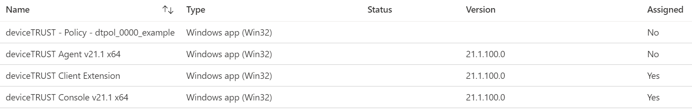

## IntuneApps
This section contains scripts and elements for bringing the deviceTRUST installation and config files to your Intune managed devices. It has been developed based on Nickolaj Andersens (@NickolajA)  "IntuneWin32App" PowerShell Module: https://github.com/MSEndpointMgr/IntuneWin32App. Using the module is a requirement for our config to be applied.

## Preparation (`prepare-workstation.ps1`)
The script `prepare-workstation.ps1` needs to be executed at least once. It prepares your subscription, as well as your machine for bringing the apps to Intune.

- If not already installed, install the required PowerShell Modules.
```PowerShell
# IntuneWin32App https://github.com/MSEndpointMgr/IntuneWin32App
if(-not (Get-Module 'IntuneWin32App')){Install-Module 'IntuneWin32App' -Force}

# AzureAD
if(-not (Get-Module 'AzureAD')){Install-Module 'AzureAD' -Force}

# Microsoft.Graph.Intune
if(-not (Get-Module 'Microsoft.Graph.Intune')){Install-Module 'Microsoft.Graph.Intune' -Force}
```

- Connect to MSGraph and generate Enterprise Application.
```PowerShell
Connect-MSGraph -AdminConsent
```

- Restart your administrative PowerShell Session and you're good to go!

## App installation (`create-dT-intuneapp.ps1`)
The script `create-dT-intuneapp.ps1` creates an Intune application based on your given iput type. Please see the inline comments for details. 

The following parameters need to be set when executing the script. 
```
$InputFolder --> Path to your sources. Can either be a folder containing policy content or any of our software components.
$SoftwareType --> The application type to be created needs to be set. Properties and requirements differ for each kind. Possible values:
- dtclient
- dtconsole
- dtagent
- dtpol
$InstallGroup --> Optionally, you can configure an AAD group by name, that the app will be assigned to with "install" flag
$UninstallGroup --> Optionally, you can configure an AAD group by name, that the app will be assigned to with "uninstall" flag
```
A full command including your variables would look like this:
```PowerShell
& $ParentPath\create-dT-intuneapp.ps1 -InputFolder $InputFolder -SoftwareType $SoftwareType -InstallGroup $InstallGroup -UninstallGroup $UninstallGroup
```
The following command would
- search for a deviceTRUST Agent file (-SoftwareType)
- inside "c:\temp\dT-Apps" (-InputFolder)
- create the *.intunewin-file
- create the Intune app will all required properties
- create an install assignment for "Intune Managed Devices" (-InstallGroup)
- create an uninstall assignment for "Some Other Group" (-InstallGroup)
```PowerShell
& $ParentPath\create-dT-intuneapp.ps1 -InputFolder "c:\temp\dT-Apps" -SoftwareType dtagent -InstallGroup "Intune Managed Devices" -UninstallGroup "Some Other Group" 
```
## Input Folders
The tool for *.intunewin-file creation does always add all files in the folder to the package. We do, thus, highly recommend separating all three software components in each own's folder. Could look like this:
```
- c:\temp\dT-Apps
- c:\temp\dT-Apps\dtconsole
- c:\temp\dT-Apps\dtconsole\%dTAgentFileName%.exe
- c:\temp\dT-Apps\dtagent
- c:\temp\dT-Apps\dtagent\%dTAgentFileName%.exe
- c:\temp\dT-Apps\dtclient
- c:\temp\dT-Apps\dtclient\%dTClientFileName%.exe
```
The script does automatically scan all child folders of $InputFolder and choses the required folder based on the given $SoftwareType



## Version Information
All configurations have been created and tested with (at least) deviceTRUST Host and Console version `21.1`. Please upgrade accordingly or modify the configurations, if you whitness issues. 

## Contributing
To contribute to the configurations, follow these steps:

- Fork this repository
- Create a branch: git checkout -b <branch_name>
- Make your changes and commit them: git commit -m '<commit_message>'
- Push to the original branch: git push origin Configurations/master
- Create the pull request
- Alternatively see the GitHub documentation on creating a pull request

## Support
All content in our GitHub account is released as-is. deviceTRUST does not provide any warranty and no support for any content found here. If you have any issues or comments, please file an issue on the repository.
